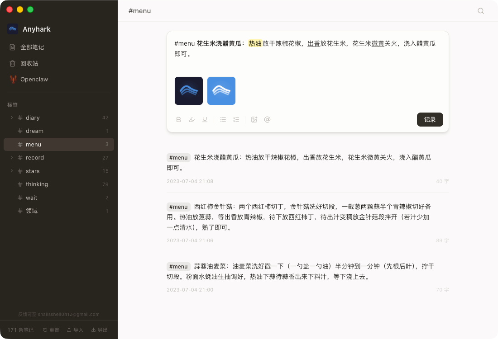
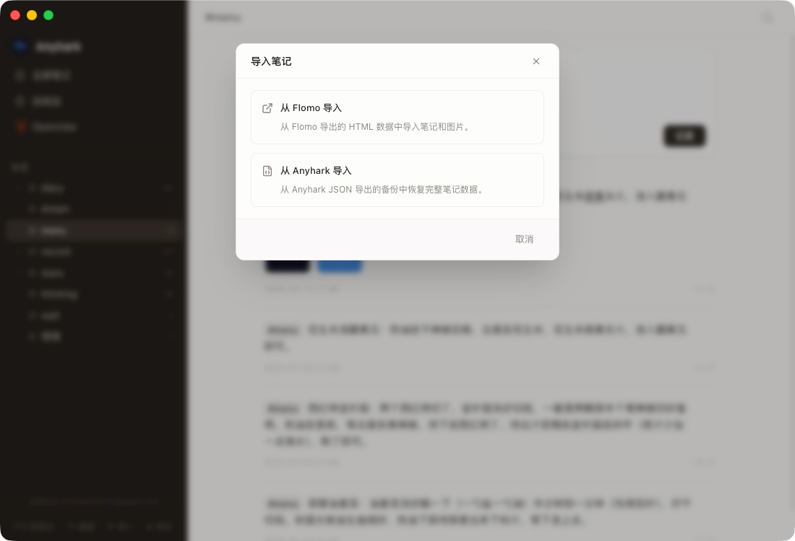
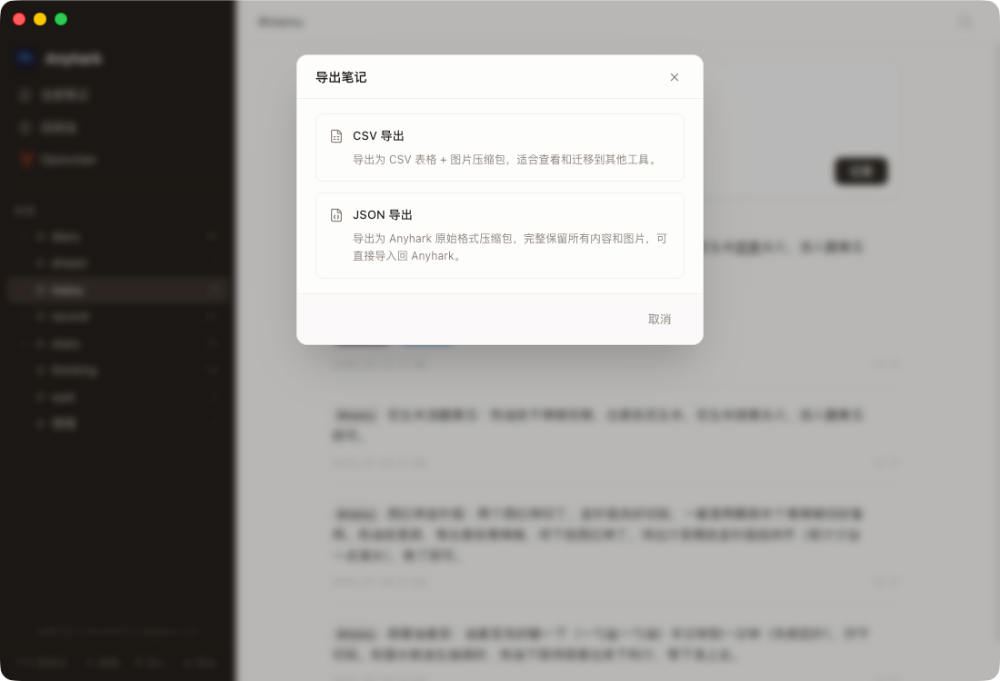
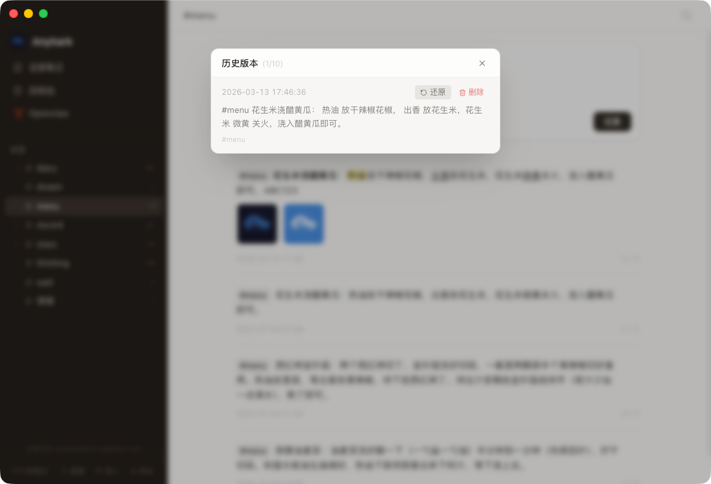
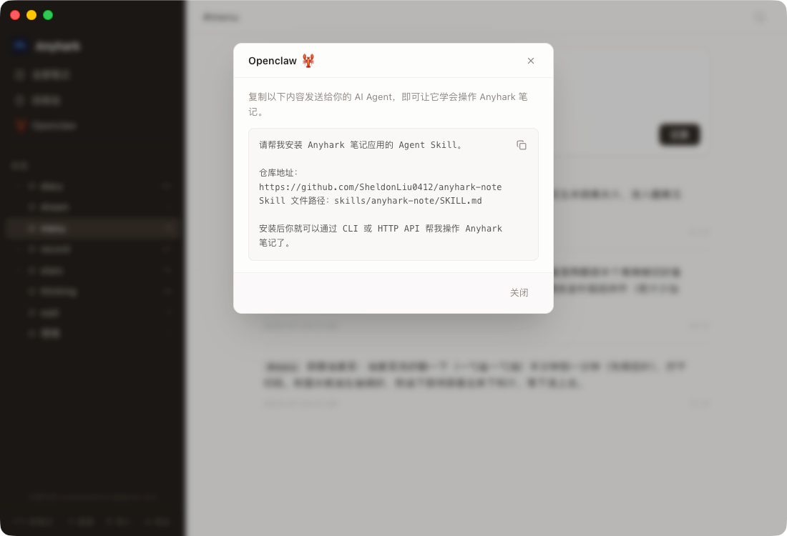
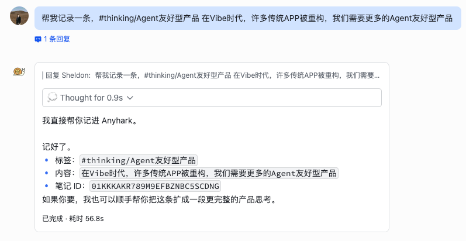

<p align="center">
  
</p>

<h1 align="center">Anyhark</h1>

<p align="center">
  一个面向人类和 Ta 的 Agent 分身的本地知识笔记应用（现阶段已支持卡片笔记）
  -- “人类负责 Any ，Agent负责 Hark ”
</p>

<p align="center">
  <a href="LICENSE"></a>
  
</p>

---

## 了解 Anyhark

1. 坚信在Vibe时代，我们会看到更多 Agent 友好型 APP
2. 人生是一场巨大的上下文，Anyhark 希望让你的上下文能够被更好的记录与“听到”
3. Anyhark 所有数据存在本地，不注册、不联网也能用；内置了本地 API 及 SKILL，AI Agent 可以直接帮你读写笔记及更多操作（详见预置SKILL.md）；
4. 标签体系学习了 Flomo APP、因为真的是很棒的设计、也推荐大家去用去订阅；大家会很快发现 Anyhark 的定位完全不同，这部分见2.
5. Anyhark 会面向 Agent 设计能力，例如下一步所需要的备份功能，我希望 Agent 独立完成，只在必要时申请你的协助；--“用户变了，是时候重新看待产品使用成本了”

## 是什么

一个桌面端的知识管理应用，核心功能：

- **随手记** — 打开就写，用 `#标签` 归类，支持多级标签（比如 `#工作/周报`）
- **富文本** — 加粗、高亮、列表、@笔记/网址、检索、插入图片，够用就好
- **历史版本** — 每次修改自动存档，最多保留 10 个版本，随时可以回退
- **导入导出** — 支持从 Flomo 迁移过来；也可以导出为 CSV 或 JSON 备份
- **回收站** — 删错了可以找回来
- **全文搜索** — 按关键词或标签检索

<p align="center">
  
</p>

## 安装

到 [Releases](https://github.com/SheldonLiu0412/anyhark-note/releases) 页面下载对应系统的安装包：

| 系统 | 文件 |
|------|------|
| macOS (Apple Silicon) | `anyhark-x.x.x-arm64.dmg` |
| macOS (Intel) | `anyhark-x.x.x-x64.dmg` |
| Windows | `anyhark-x.x.x-setup.exe` |

下载后双击安装即可。

## 怎么用

### 记笔记

打开应用，在顶部编辑区写内容，点「记录」保存。

想分类的话，在内容里写 `#标签名` 就行，比如 `#读书笔记 今天看了...`。左侧边栏会自动出现对应的标签，点标签可以筛选。

### 导入旧数据

如果你同时在用 Flomo，可以先在 Flomo 网页版导出数据，然后在 Anyhark 里点底部的「导入」按钮，选 Flomo 导出的文件夹，笔记和图片都会一起导入。
「事实上，你可以直接把任意导出的笔记发送给连接了 Anyhark 的 AI Agent，让其使用脚本帮你完成笔记的录入和整理；」


<p align="center">
  
  
</p>

### 历史版本

每条笔记修改后会自动保存历史。在笔记卡片上点击时间戳旁的版本按钮，可以查看、还原或删除旧版本。

<p align="center">
  
</p>

## 让 AI 帮你记笔记

这是 Anyhark 和传统笔记应用不太一样的地方，Agent是链接人与上下文很好的媒介，应该被用心对待。

应用运行时会在本地开一个 API 服务，AI Agent 可以通过它来帮你创建、搜索、管理笔记。你不用关心技术细节，只需要：

1. 点侧边栏的 **Openclaw 🦞** 按钮
2. 复制弹窗里的那段话，发给你的 AI Agent
3. Agent 会自动从仓库获取操作指南，然后就学会了

<p align="center">
  
</p>

之后你就可以用自然语言让 AI 帮你记东西了，比如"帮我记一条，#thinking 今天的想法是..."：

<p align="center">
  
</p>

如果你是开发者，也可以直接用 CLI 或 HTTP API 来操作，详见 [skills/anyhark-note/SKILL.md](skills/anyhark-note/SKILL.md)。

## 从源码运行

```bash
git clone https://github.com/SheldonLiu0412/anyhark-note.git
cd anyhark-note
npm install
npm run dev
```

## 开源协议

[MIT](LICENSE)
