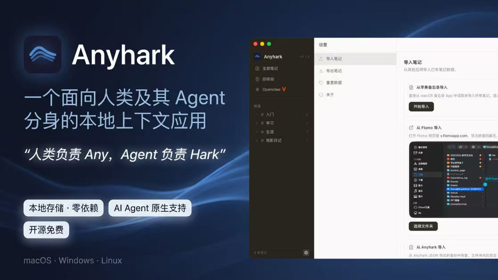
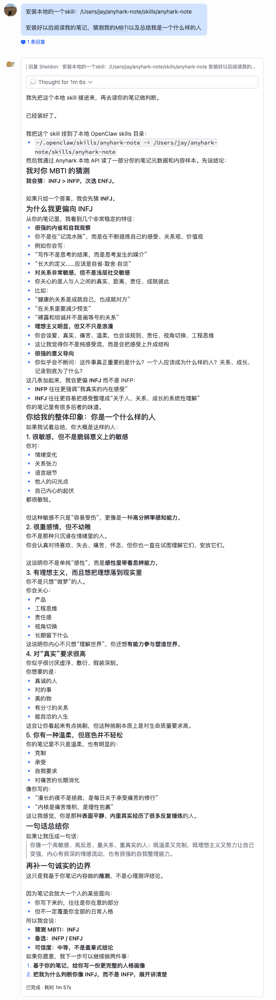

<p align="center">
  
</p>

<h1 align="center">Anyhark</h1>

<p align="center">
  一个面向人类及其 Agent 分身的本地上下文应用。
</p>

<p align="center">
  “人类负责 Any ，Agent负责 Hark ”
</p>

<p align="center">
  <a href="LICENSE"></a>
  
</p>

<p align="center">
  
</p>


---

## 了解 Anyhark

1. 在Vibe时代，我们会看到更多 Agent 友好型 APP
2. 人生是一场巨大的上下文，Anyhark 希望让你的上下文能够被更好的记录与“听到”，不止于笔记
3. Anyhark 所有数据存在本地，不注册、不联网；不构建MCP，基于 CLI 及 预置 SKILL ，AI Agent 可以直接帮你读写笔记及更多操作，详见 [skills/anyhark-note/SKILL.md](skills/anyhark-note/SKILL.md)；
4. 交互学习了Apple备忘录、标签体系学习了 Flomo APP、从理念到体验都很棒的产品、也推荐大家去用；
5. Anyhark 希望更多面向 Agent 设计能力，为其添加优化 CLI 能力，通过SKILL完成能力的一站式创建、迁移、复用；非必要不向用户增加使用成本。
6. 最简使用方式：复制本页链接直接发给你的本地 Agent 学习即可

## 当前核心功能

一个桌面端的上下文管理应用（尽管初版仍像一款笔记软件，但后续设计方向是融入用户的多源上下文），当前核心功能：

- **连接本地Agent** — 一键复制给本地的Openclaw🦞，让它学会使用 Anyhark
- **随手记存** — 打开就写，用 `#标签` 归类，支持多级标签（比如 `#工作/周报`），自动保存；修改后可在历史记录中回退，删除支持回收站还原；
- **富文本** — 加粗、高亮、列表、@笔记/网址、检索、插入图片，够用就好
- **导入导出** — 支持从 Flomo、苹果备忘录迁移过来；也可以导出为 CSV （与Flomo的导入格式相同）或 JSON 备份
- **全文搜索** — 按关键词或标签检索

<p align="center">
  
</p>

## 安装

到 [Releases](https://github.com/SheldonLiu0412/anyhark-note/releases) 页面下载对应系统的安装包：

| 系统 | 文件 |
|------|------|
| macOS (Apple Silicon) | `anyhark-x.x.x-arm64.dmg` |
| macOS (Intel) | `anyhark-x.x.x-x64.dmg` |
| Windows | `anyhark-x.x.x-setup.exe` |

下载后双击安装即可。

## 快速上手

### 导入旧数据

点左下角 ⚙️ 进入设置，选择「导入笔记」，目前支持：

- **苹果备忘录**（macOS）— 直接从备忘录 App 读取，无需手动导出。导入后原文中的 `#` 会转为 `+` 以避免标签冲突，每条笔记自动添加 `#AppleNotes/文件夹/前5字` 标签，可配合 AI Agent 进一步整理。
- **Flomo** — 在 Flomo 网页版导出数据，选择导出的文件夹即可导入笔记和图片。

「事实上，你可以直接把任意导出的笔记发送给连接了 Anyhark 的 AI Agent，让其使用脚本帮你完成笔记的录入和整理；」


<p align="center">
  
  
</p>

### 历史版本

每条笔记修改后会自动保存历史。在右侧详情面板的底部状态栏点击版本按钮，可以查看、还原或删除旧版本。

<p align="center">
  
</p>

## 让 AI 帮你记笔记

这是 Anyhark 和传统笔记应用不太一样的地方，Agent是链接人与上下文很好的媒介，应该被用心对待。

应用运行时会在本地开一个 API 服务，AI Agent 可以通过它来帮你创建、搜索、管理笔记。你不用关心技术细节，只需要：

1. 点侧边栏的 **Openclaw 🦞** 按钮
2. 复制弹窗里的那段话，发给你的 AI Agent
3. Agent 会自动从仓库获取操作指南，然后就学会了

<p align="center">
  
</p>

Agent 是与你相同的用户，拥有检索、记录、导出等丰富能力，且并不局限于单条笔记的操作...

<p align="center">
  
</p>

让 AI 听见你，与 Ta，与自己深度对话：

<p align="center">
  
</p>

如果你是开发者，也可以直接用 CLI 或 HTTP API 来操作，详见 [skills/anyhark-note/SKILL.md](skills/anyhark-note/SKILL.md)。

## 从源码运行

```bash
git clone https://github.com/SheldonLiu0412/anyhark-note.git
cd anyhark-note
npm install
npm run dev
```

## 开源协议

[MIT](LICENSE)
